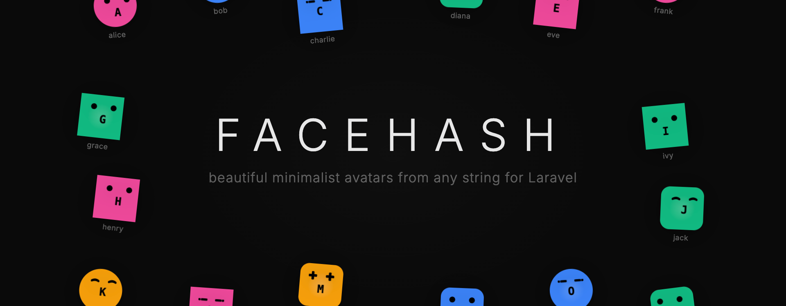

# Facehash for Laravel



Deterministic avatar faces from any string. A PHP/Laravel port of the [facehash](https://facehash.dev) JavaScript library.

Generates unique, consistent SVG avatars based on a name, email, or any string input. No GD, Imagick, or external services required — pure SVG output.

## Requirements

- PHP 8.2+
- Laravel 11 or 12

## Installation

```bash
composer require saade/facehash
```

## Quick Start

```php
use Saade\Facehash\Facades\Facehash;

// Generate an SVG string
$svg = Facehash::name('Saade')->toSvg();

// Embed as a data URI in an  tag
$uri = Facehash::name('Saade')->toUri();
// 
```

## API

All methods return a new instance (immutable), so you can chain freely without affecting the original.

### `name(string $name)`

**Required.** The input string to generate the avatar from. The same string always produces the same face.

```php
Facehash::name('alice@example.com')->toSvg();
```

### `size(int $pixels)`

Avatar dimensions in pixels. Default: `40`.

```php
Facehash::name('Saade')->size(128)->toSvg();
```

### `variant(string $variant)`

Background style. Accepts `'gradient'` or `'solid'`. Default: `'gradient'`.

```php
Facehash::name('Saade')->variant('solid')->toSvg();
```

### `format(string $format)`

Avatar shape. Accepts `'square'`, `'squircle'`, or `'circle'`. Default: `'circle'`.

```php
Facehash::name('Saade')->format('squircle')->toSvg();
```

### `blink(bool $enable = true)`

Adds a CSS blink animation to the eyes inside the SVG. Default: `false`.

```php
Facehash::name('Saade')->blink()->toSvg();
```

### `initial(bool $show = true)`

Show the first letter of the name below the eyes. Default: `true`.

```php
Facehash::name('Saade')->initial(false)->toSvg();
```

### `colors(array $colors)`

Override the color palette. Each avatar picks a color deterministically from this array.

```php
Facehash::name('Saade')->colors(['#6366f1', '#8b5cf6', '#a78bfa'])->toSvg();
```

### Output Methods

| Method       | Returns                                    |
| ------------ | ------------------------------------------ |
| `toSvg()`    | Raw SVG string                             |
| `toBase64()` | Base64-encoded SVG string                  |
| `toUri()`    | Data URI (`data:image/svg+xml;base64,...`) |

## HTTP Route

The package includes an optional `GET` route that serves avatars as `image/svg+xml` responses with long-lived cache headers. The route is **disabled by default** — enable it in your config:

```php
// config/facehash.php
'route' => [
    'enabled' => true,
    // ...
],
```

```
GET /facehash?name=Saade
```

### Query Parameters

| Parameter  | Type     | Default    | Description              |
| ---------- | -------- | ---------- | ------------------------ |
| `name`     | string   | *required* | Input string             |
| `size`     | int      | `40`       | Size in pixels (16–1024) |
| `variant`  | string   | `gradient` | `gradient` or `solid`    |
| `format`   | string   | `circle`   | `square`, `squircle`, or `circle` |
| `initial`  | bool     | `true`     | Show initial letter      |
| `blink`    | bool     | `false`    | Enable blink animation   |
| `colors[]` | string[] | —          | Custom hex color palette |

### Examples

```html
<!-- Basic usage -->


<!-- Larger, solid variant -->


<!-- Custom colors -->

```

## Blade Usage

```blade
{{-- Inline SVG --}}
{!! Facehash::name($user->name)->size(48)->toSvg() !!}

{{-- As  src --}}
name)->size(48)->toUri() }}" alt="{{ $user->name }}">

{{-- Via route --}}
 $user->name, 'size' => 48]) }}" alt="{{ $user->name }}">
```

## Configuration

Publish the config file:

```bash
php artisan vendor:publish --tag=facehash-config
```

This creates `config/facehash.php`:

```php
return [
    'defaults' => [
        'size' => 40,
        'variant' => 'gradient',  // 'gradient' or 'solid'
        'format' => 'circle',     // 'square', 'squircle', or 'circle'
        'initial' => true,
        'blink' => false,
    ],

    'colors' => ['#ec4899', '#f59e0b', '#3b82f6', '#f97316', '#10b981'],

    'route' => [
        'enabled' => false,
        'prefix' => 'facehash',
        'middleware' => ['web'],
        'cache_control' => 'public, max-age=31536000, immutable',
    ],
];
```

### Config Options

**`defaults`** — Default values for the builder. Any method call overrides these per-instance.

**`colors`** — The color palette. Each avatar deterministically picks one color from this array. The default palette uses Tailwind CSS 500-weight colors.

**`route.enabled`** — Set to `true` to register the HTTP endpoint. Disabled by default.

**`route.prefix`** — URL path for the HTTP endpoint.

**`route.middleware`** — Middleware applied to the route.

**`route.cache_control`** — Cache-Control header value. The default serves immutable responses cached for 1 year — safe because the same input always produces the same output.

## How It Works

1. The input string is hashed to a deterministic 32-bit integer
2. The hash selects a **face type** (round, cross, line, curved), a **color**, and a **rotation** (3D look direction)
3. The SVG renderer composites: clip path (circle, square, or squircle), background color, gradient overlay, eye shapes, position offset, and initial letter
4. The same string always produces the exact same SVG — across requests, servers, and deployments

The hash function is a direct port of the JavaScript original, producing identical output for any given input.

### Face Types

| Type   | Description           |
| ------ | --------------------- |
| Round  | Circular dot eyes     |
| Cross  | Plus-sign shaped eyes |
| Line   | Horizontal bar eyes   |
| Curved | Sleepy/arc eyes       |

### Unique Combinations

4 face types &times; 5 colors &times; 9 rotation positions = **180** visually distinct avatars from the default palette. Custom color palettes increase this further.

## Demo

A standalone demo page is included for testing without Laravel:

```bash
php -S localhost:8080 demo.php
```

Open `http://localhost:8080` to see the avatar gallery, variant comparisons, and an interactive playground.

## Credits

This package is a PHP/Laravel port of [facehash](https://facehash.dev) by [Cossistant](https://github.com/cossistantcom/cossistant). The original JavaScript library provides the face SVG data, hash algorithm, and rendering logic that this package faithfully reproduces.

## License

MIT
